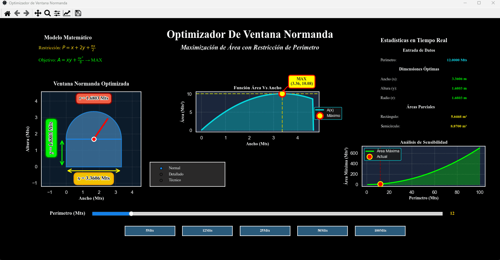

[](README.es.md)

# 🔷 GeoFrame - Norman Window Optimizer


**Interactive application to calculate and visualize the optimal dimensions of Norman windows**

---

## 🎬 Preview

<div align="center">
  
</div>

---

## 👤 Author

- **Developer:** Carlos Gabriel Magallanes López
- **Email:** cgmagallanes23@gmail.com
- **GitHub:** [@TheNarratorVIMMXX](https://github.com/TheNarratorVIMMXX)
- **Date:** December 2025

---

## 📑 Table of Contents

- [📖 Project Description](#-project-description)
- [🎯 Mathematical Problem](#-mathematical-problem)
- [📐 Mathematical Foundation](#-mathematical-foundation)
- [⚡ Features](#-features)
- [🔧 Technical Implementation](#-technical-implementation)
- [💾 Installation](#-installation)
- [🖥️ Display Configuration](#️-display-configuration)
- [🚀 Usage](#-usage)
- [📜 License](#-license)

---

## 📖 Project Description

**GeoFrame** is a scientific application developed in Python that solves a classic **constrained optimization problem**: finding the optimal dimensions of a Norman window that **maximize its area** given a **fixed perimeter**.

This project was conceived as an educational tool to visualize and understand mathematical concepts such as optimization, derivatives, and practical applications of calculus in architectural design.

### 🏛️ What is a Norman Window?

A **Norman window** (also known as a semicircular or Romanesque window) is an architectural structure composed of:
- A **rectangle** with base `x` and height `y`
- A **semicircle** with radius `r = x/2` placed on top of the rectangle

This classic architectural design combines structural stability with aesthetics, and presents an interesting mathematical challenge: **How do you distribute a limited perimeter to obtain the maximum possible area?**

---

## 🎯 Mathematical Problem

### 💡 The Challenge

Imagine you have a window frame with a fixed perimeter `P` (for example, 12 meters of material). How should you design the window to allow the **greatest amount of light** (area) possible?

This is not an intuitive problem because:
- If the window is too wide, the height decreases
- If it is too tall, the width and semicircle shrink
- The optimal balance requires calculus and optimization techniques

---

## 📐 Mathematical Foundation

### 1️⃣ Constraint Equation (Perimeter)

The perimeter of a Norman window is composed of:
- Rectangle base: `x`
- Two vertical sides: `2y`
- Upper semicircle: `πr = π(x/2)`

**Perimeter constraint:**
```
P = x + 2y + πx/2
P = x(1 + π/2) + 2y
```

Solving for `y`:
```
y = (P - x(1 + π/2)) / 2
```

### 2️⃣ Objective Function (Area)

The total area is the sum of:
- Rectangle area: `A_rect = xy`
- Semicircle area: `A_semi = πr²/2 = π(x/2)²/2 = πx²/8`

**Total area function:**
```
A(x) = xy + πx²/8
```

Substituting `y` from the constraint:
```
A(x) = x · [(P - x(1 + π/2))/2] + πx²/8
A(x) = (Px)/2 - x²(1 + π/2)/2 + πx²/8
A(x) = (Px)/2 - x²/2 - πx²/4 + πx²/8
A(x) = (Px)/2 - x²/2 - πx²/8
```

### 3️⃣ Optimization (Finding the Maximum)

To find the maximum, we take the derivative and set it to zero:

```
dA/dx = P/2 - x - πx/4 = 0
P/2 = x(1 + π/4)
x_optimal = P / (2 + π/2)
```

Once `x_optimal` is obtained, we calculate:
```
y_optimal = (P - x_optimal(1 + π/2)) / 2
A_max = x_optimal · y_optimal + π(x_optimal)²/8
```

### 4️⃣ Verification (Second Derivative Test)

To confirm it is a maximum (and not a minimum):
```
d²A/dx² = -1 - π/4 < 0  ✓ (Confirms it is a maximum)
```

---

## ⚡ Features

### 🎮 Core Functionality
- **Automatic optimization:** Calculates optimal dimensions (x, y, r) using advanced numerical methods (SciPy)
- **Real-time updates:** All visualizations update dynamically when the perimeter changes
- **Interactive slider:** Adjust the perimeter from 1 to 100 meters with 0.1 precision
- **Quick default values:** Buttons for common values (5, 12, 25, 50, 100 meters)

### 📊 Visualization Panels

**1. 🖼️ Norman Window Panel**
- Interactive geometric representation
- Annotated dimensions with arrows
- Three visualization modes:
  - **Normal:** Clean basic view
  - **Detailed:** Grid lines and multiple layers
  - **Technical:** Full specifications with partial areas

**2. 📈 Area vs Width Graph**
- Curve of the area function A(x)
- Visual identification of the maximum point
- Reference lines toward optimal dimensions
- Dynamic annotation with coordinates

**3. 📋 Numerical Results Panel**
- Input data display
- Optimal dimensions (x, y, r)
- Partial areas (rectangle and semicircle)
- All values with 4-decimal precision

**4. 🔍 Sensitivity Analysis Graph**
- Shows how maximum area varies with perimeter
- Range from 1 to 100 meters
- Highlight of the current point
- Useful for hypothetical scenario analysis

### ⚙️ Performance Optimizations
- **Smart cache:** Stores previously calculated results to avoid redundant computations
- **Precalculation:** Sensitivity data is calculated once and reused
- **History management:** Keeps a record of the last 20 calculations

---

## 🔧 Technical Implementation

### 🛠️ Technologies Used

| Library | Version | Purpose |
|---------|---------|---------|
| **Python** | 3.13.0 | Main programming language |
| **Matplotlib** | 3.10.7 | Advanced graphing and visualization |
| **Seaborn** | 0.13.2 | Professional graph styling |
| **PyQt5** | Latest | GUI and window management |
| **NumPy** | Latest | Numerical computing and array operations |
| **SciPy** | Latest | Advanced optimization algorithms (`minimize_scalar`) |

### 🏗️ Architecture

The application follows **Object-Oriented Programming** principles:
- **`GeoFrame` Class:** Main application controller
- **Separation of concerns:** Each panel has its own update method
- **Event-driven design:** Responds to user interactions (slider, buttons, radio buttons)
- **Modular structure:** Easy to maintain and extend

---

## 💾 Installation

**No installation or dependencies required!** The game is available as a ready-to-use executable.

### 📥 Download & Run

1. Go to the [Releases](https://github.com/TheNarratorVIMMXX/GeoFrame/releases) section
2. Download the `GeoFrame.exe` file
3. Double-click to run
4. Done!

> ⚠️ **Note:** Python does not need to be installed or any environment configured.

---

## 🖥️ Display Configuration

### 📺 Recommended Settings for Optimal Viewing

For the best visual experience with **GeoFrame**, we recommend the following display configuration:

#### Display Resolution

| Setting | Value |
|---------|-------|
| **Recommended** | 1920 × 1080 (Full HD) |
| **Minimum** | 1280 × 720 |

This resolution ensures all panels, graphs, and controls display correctly without overlapping.

#### Scale & Layout (Windows)

The application interface is optimized for two specific zoom levels:

| Option | Scale | Best For |
|--------|-------|----------|
| **Option 1 (Recommended)** | 150% | Best balance between visibility and screen space |
| **Option 2** | 100% | Maximum screen usage, all panels visible simultaneously |

#### How to Adjust Display Settings (Windows 10/11)

1. Right-click on the desktop and select **Display settings**
2. Under **Scale & layout**, find the **Display resolution** dropdown
   - Set to **1920 × 1080 (Recommended)**
3. In the same section, find the **Scale** dropdown
   - Choose **100%** or **150%** based on your preference
4. Click **Apply** and restart the GeoFrame application

#### ⚠️ Important Notes
- **Other resolutions:** The app will work but layout may not be optimal
- **Other scales:** Using 125% or 175% may cause minor alignment issues
- **Multiple monitors:** Ensure GeoFrame runs on the monitor with the recommended configuration

---

## 🚀 Usage

### 🎯 Basic Operation

1. **Open the app:** Double-click to run the application
2. **Adjust the perimeter:** Use the interactive slider or preset buttons
3. **Read the results:** All panels update automatically
4. **Change view mode:** Use the radio buttons (Normal / Detailed / Technical)
5. **Analyze sensitivity:** Observe how the area changes with different perimeters

### 📊 Interpreting Results

**Example with P = 12 meters:**
```
Optimal Width (x):        4.2667 m
Optimal Height (y):       1.6234 m
Semicircle Radius:        2.1333 m
Maximum Area:            13.5752 m²
```

This means that with 12 meters of perimeter, the design that allows the most light is a window 4.27 meters wide and 1.62 meters tall, with a total area of 13.58 square meters.

---

## 📜 License

### PROPRIETARY SOFTWARE LICENSE
**Copyright © 2025 Carlos Gabriel Magallanes López**  
**All Rights Reserved**

---

### LICENSE GRANT

This license allows you to:

✅ Download and use the software for personal and educational purposes  
✅ Install and run the application on your personal devices  
✅ Create derivative works based on the software

---

### RESTRICTIONS

You may **NOT**:

❌ Modify, reverse engineer, decompile, or disassemble the software  
❌ Redistribute, share, or make copies available to others  
❌ Use the software for commercial purposes without written permission  
❌ Remove or modify copyright notices or proprietary marks  

---

### DISCLAIMER

This software is provided "as is", without warranties of any kind. The author is not responsible for damages or issues arising from the use of the software.

---

For licensing inquiries, commercial use, or permissions:

📧 **Email:** cgmagallanes23@gmail.com

**Last Updated:** December 16, 2025

---

**© 2025 Carlos Gabriel Magallanes López. All rights reserved.**
